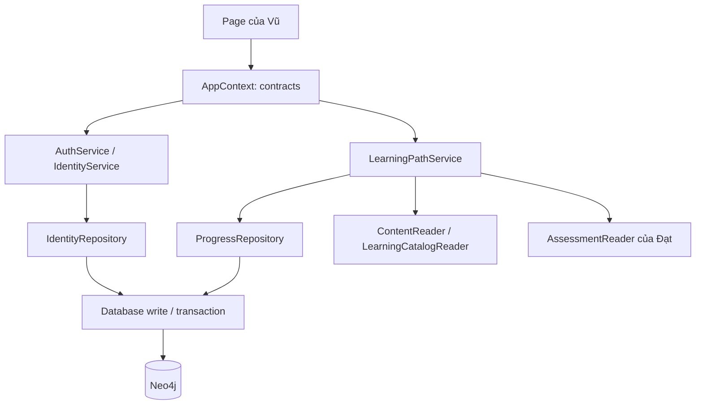

# Phần nghiệp vụ của Vũ và hướng dẫn đọc source code

Tài liệu này giúp Vũ hiểu phần mình phụ trách trong QuadLearn: tính năng nào đã chạy, dữ liệu đi qua những file nào, hàm nào quyết định nghiệp vụ và điểm nào cần cẩn thận khi sửa. Phần triển khai nằm trên branch `feature/vu-identity-learning-path`, được phát triển từ skeleton đã lên main. Sơn và Đạt vẫn giữ quyền sở hữu feature của mình.

Điểm quan trọng nhất: **Vũ quản lý danh tính và tiến độ của người học, không quản lý nội dung bài học hoặc chi tiết bài làm**. Password, session, trạng thái học và cấp độ là phần Vũ; Lesson/REQUIRES thuộc Sơn; Attempt/Answer thuộc Đạt. Các domain kết nối bằng contracts được gắn ở composition root.

## 1. Những gì đã chạy và giới hạn hiện tại

| Nhóm | Đã triển khai | Chưa triển khai / giới hạn |
|---|---|---|
| Đăng ký | Tên, email chuẩn hóa, password có chữ/số, lớp 6–9, tuổi khai báo, guardian email nếu dưới 16; email unique ở Neo4j; role luôn student | Google OAuth, email gửi thực tế; xác minh tuổi/danh tính thực tế |
| Kích hoạt | Tài khoản pending; token verify và guardian; chỉ active khi đủ điều kiện; token có hạn và dùng một lần | Token thử nghiệm local xuất hiện ở browser đăng ký, không phải email đã gửi hoặc đồng ý phụ huynh ngoài đời |
| Đăng nhập | Password hash Argon2id, kiểm password, lock sau 5 lần sai/15 phút, status active, session backend | Chưa nghiệm thu bảo mật production, RBAC toàn bộ các domain hay bảo vệ admin nâng cao |
| Phiên | Session token ngẫu nhiên, hash trong Neo4j, idle timeout 7 ngày mặc định, logout, revoke khi đổi/reset password hoặc admin khóa | Raw session chỉ trong Streamlit session_state; reload/mất websocket có thể phải đăng nhập lại. Chưa có cookie remember-me/OAuth |
| Mật khẩu | Kiểm mật khẩu cũ; reset token 30 phút dùng một lần; session cũ bị vô hiệu | Gửi email reset thật và chống lạm dụng yêu cầu reset ở production |
| Hồ sơ | Tên, language vi/en, URL avatar; đổi lớp qua learning policy | Upload ảnh, toàn bộ UI i18n; xóa tài khoản/dữ liệu cần contract Đạt chưa có |
| Lộ trình | Cây lớp→chương→chủ đề→bài published, nhãn mức nhận thức, tiên quyết đa cấp | Nội dung toàn bộ lớp 6–9 do Sơn phát triển; bảng hình động không thuộc Vũ |
| Tiến độ | Bắt đầu bài, hoàn thành idempotent; % theo lớp/chương/chủ đề; Progress riêng từng lớp, resume bài dở | Không suy ra completion từ essay khi quy tắc đó chưa được nhóm chốt |
| Mở khóa | Ngưỡng cấu hình mặc định 70% và 6/10; thiếu điểm không tự đạt; học vượt phải xác nhận; xem lại lớp dưới | Đây là policy tạm thời theo A7/Q4 SRS, chưa là quy tắc sản phẩm được duyệt |
| Lịch sử/thống kê | Đọc attempts của Đạt, phân tích trung bình chủ đề, điểm <5 gợi ý bài tiên quyết chưa hoàn thành | Contract chưa có timestamps/thời lượng/đáp án: chưa có biểu đồ theo ngày hoặc xem lại đáp án chi tiết |
| Admin | Đăng nhập cùng AUTH, service kiểm role; tìm tên/email, khóa/mở khóa và revoke session | Chưa thống kê chat/đánh giá AI toàn hệ thống, chưa trang config session, không sửa dữ liệu nội dung/assessment |

**Không gọi toàn bộ AUTH hoặc toàn bộ domain “hoàn tất SRS”.** Đây là nghiệp vụ local có kiểm thử; các FR chứa email/OAuth/xóa dữ liệu/liên domain chưa hoàn tất được ghi riêng. Chỉ dùng tài khoản giả để demo, không nhập dữ liệu học sinh thật.

## 2. SRS đã được dùng như thế nào

Đã đọc README/GIT_WORKFLOW của Vũ, README root, RUN_PROJECT, SETUP_MACOS, ARCHITECTURE, GRAPH_SCHEMA, DOMAIN_OWNERSHIP, FEATURE_INTEGRATION, OPEN_QUESTIONS, SRS_TRACEABILITY và PRODUCT_BACKLOG. SRS gốc v1.1 là nguồn nghiệp vụ; bảng 86 FR trong repo giúp đối chiếu, không tự thay đổi yêu cầu.

| FR / màn hình | Phần thực hiện | Trạng thái |
|---|---|---|
| AUTH-01/02/04/07/08/10; SCR-02 | Đăng ký, validation, login/lockout, đổi password, logout/idle timeout | Đã chạy local; phiên không phải remember-me production |
| AUTH-03/06/12; SCR-02 | Lifecycle token verify/guardian/reset, chặn pending | Có nghiệp vụ local; gửi email và xác minh thực tế TODO |
| AUTH-05 | Google OAuth/link account | TODO |
| AUTH-09; SCR-12 | Tên, language, URL avatar; grade qua policy | Có cơ bản; upload ảnh/i18n toàn UI TODO |
| AUTH-11 | Xóa user và dữ liệu cá nhân | TODO, cần Đạt cung cấp contract xóa bài làm/chat; không xóa hộ |
| LRN-05 phối hợp; PG-01/05; LV-01/02/03/05/10; SCR-03/04/17 | Completion, projections, catalog, resume, chuyển/xem cấp | Đã triển khai trong phạm vi Vũ; UI đánh dấu trong page Vũ và ProgressWriter cho Sơn |
| LV-06/07/08; PG-04/06 | Threshold, học vượt, prerequisites, topic stats/review | Đã chạy theo policy tạm thời; ưu tiên SRS vẫn Should/Could |
| PG-02/03; SCR-11 | Lịch sử qua AssessmentReader | Có summary, chi tiết/timeline chưa đủ contract |
| AD-01/09; SCR-16 | Role admin, search, lock/unlock | RBAC cơ bản; bảo vệ nâng cao TODO |
| AD-10; SCR-13 | Danh sách người dùng có giới hạn 100 | Chưa dashboard thống kê toàn bộ SRS; không gọi count kết quả là tổng số HS |
| AD-11 phối hợp | Config thời gian session bằng env | Có local config; UI admin config TODO; quota AI thuộc Đạt |
| I18-01 phối hợp | Ghi User.language | Có preference; dictionaries và UI song ngữ toàn hệ thống thuộc Sơn |
| LV-11 | Bài kiểm tra xếp loại đầu vào | TODO, cần đề/điểm từ Đạt |

Prefix bảng được rút gọn: `AUTH-01` nghĩa là `FR-AUTH-01`, tương tự PG/LV/AD. Ngưỡng 70% và 6/10 xuất phát A7, không tự nhận Q4 đã được duyệt. Điểm trung bình mặc định dùng **mọi attempt completed thuộc chủ đề có bài published trong lớp**, mỗi lần trọng số bằng nhau. Có lựa chọn `latest` theo thứ tự mới nhất trước của AssessmentReader. Không tính draft, chủ đề ngoài catalog hoặc điểm ngoài 0–10. Khi đổi policy, refresh projection; `levels()` luôn tính từ nguồn hiện tại.

## 3. Cách hình dung hệ thống

Giả sử học sinh tên An đăng ký lớp 6. Trang form nhận thông tin; AuthService kiểm tra và băm password; IdentityRepository tạo User nối Level 6 và các token. An xác nhận token local, đăng nhập; session token được giữ riêng trong browser Streamlit. Khi An đánh dấu bài đã học xong, LearningPathService kiểm tra đúng người, đúng cấp và bài published. ProgressRepository ghi COMPLETED và projection. Điểm được đọc từ AssessmentReader của Đạt, không được Vũ tự tạo để “đủ ngưỡng”.



- **Page** chịu trách nhiệm form, nút, thông báo. Không đặt Cypher hoặc password hashing trong page.
- **Service** quyết định đúng/sai nghiệp vụ và được test không cần Docker.
- **Repository** chứa Cypher của owner, biết node/relationship nhưng không biết Streamlit.
- **Contract** là lời hứa về hàm và DTO: “tôi cần gì”, không chứa implementation của người khác.
- **Database** quản lý driver/session/transaction; không quyết định học sinh đủ ngưỡng hay không.

## 4. Bản đồ file — nên đọc theo thứ tự này

Các đường dẫn dưới đây tính từ root repo; trong bảng, đường dẫn bắt đầu bằng `feature/` là viết ngắn cho `app/features/identity_learning_path/`.

| File | Vai trò | Mức quan trọng |
|---|---|---|
| `feature/registry.py` | Khai báo 5 page và URL path của Vũ; thêm page tại đây | Điểm vào domain |
| `feature/pages/account.py` | Login/register/verify/reset forms; hiển thị token dev trong browser đăng ký | UI AUTH |
| `feature/pages/overview.py` | Dashboard lớp, breakdown, resume, review và history summary | UI tổng hợp |
| `feature/pages/path.py` | Cây lộ trình, nội dung/tiên quyết, nút bắt đầu/hoàn thành | UI learning path |
| `feature/pages/profile.py` | Hồ sơ, chuyển cấp/học vượt, đổi password | UI hồ sơ |
| `feature/pages/admin.py` | Danh sách người dùng, lock/unlock; service vẫn kiểm role | UI quản trị |
| `feature/pages/common.py` | Bắt IdentityError để hiện thông báo; guard đăng nhập cho pages | Helper UI |
| `feature/services/auth.py` | Lifecycle đăng ký/login/token/reset/password; dùng clock có thể thay khi test | **CORE AUTH** |
| `feature/services/identity.py` | Session hiện tại, require_user, profile, admin permissions | **CORE QUYỀN VÀ SESSION** |
| `feature/services/security.py` | Argon2 hash/verify, validate password/email, random token/digest | **CORE PASSWORD/TOKEN** |
| `feature/services/learning_path.py` | Completion %, score average, access/skip, progress writer, review | **CORE NGHIỆP VỤ HỌC TẬP** |
| `feature/repositories/identity.py` | Cypher User/token/session; khóa User và callback transaction | **CORE KẾT NỐI AUTH** |
| `feature/repositories/progress.py` | Cypher COMPLETED/LEARNING/Progress/STUDIES_AT, bảo toàn cấp cũ | **CORE KẾT NỐI PROGRESS** |
| `feature/models/policy.py` | Các mặc định/config và validate ngưỡng | CORE CẤU HÌNH NGHIỆP VỤ |
| `feature/models/errors.py` | IdentityError để phân biệt lỗi nghiệp vụ với lỗi driver | Hợp đồng lỗi |
| `feature/tools.py` | CLI tạo admin local bằng getpass, không hardcode password | Tool quản trị local |
| `feature/tests/fakes.py` | Fake repositories/readers/clock; không phải database runtime | Test doubles |
| `feature/tests/test_auth.py` | Password, guardian, lockout, session, reset, profile, admin guards | Test AUTH |
| `feature/tests/test_learning_path.py` | Percentage/average/unlock/skip/access/idempotency/review | Test business |
| `feature/tests/test_neo4j_identity.py` | Thực thi thật Neo4j và cleanup riêng data test | Test CONNECT |
| `feature/tests/test_pages.py` | AppTest forms register→verify→login→logout | Smoke UI |
| `feature/tests/test_identity.py` | Reader/danh tính demo tương thích fixture | Test nền |

Đừng học bằng cách đọc tất cả từ trên xuống như một file lớn. Trước tiên mở **registry → page → service của nút đó → repository**. Sau đó mở test tương ứng để nhìn ví dụ đầu vào đúng/sai.

### Các file chung cực kỳ quan trọng

| File | Tại sao quan trọng |
|---|---|
| [app/main.py](../app/main.py) | Entry point Streamlit; chỉ thêm việc truyền `st.session_state` vào bootstrap để danh tính riêng theo browser, không khai báo 5 page của Vũ ở đây |
| [app/core/bootstrap.py](../app/core/bootstrap.py) | Composition root: nối đúng repository/service/readers vào AppContext. Đây là nơi “cắm dây” giữa 3 domain, không phải business service |
| [app/core/context.py](../app/core/context.py) | Bó contract truyền cho page; auth/progress mới có default None để fake/consumer cũ vẫn hoạt động |
| [app/core/database.py](../app/core/database.py) | Driver chính thức, read/write, transaction callback, close; nơi kết nối Bolt với Neo4j |
| [app/core/config.py](../app/core/config.py) | Đọc .env, URI/user/database/password; password không in repr; không đổi credentials trong code |
| [app/core/catalog.py](../app/core/catalog.py) | Adapter chỉ đọc catalog published qua LearningCatalogReader, cung cấp Chapter/Topic/cognitive metadata cho Vũ mà không sửa feature Sơn |
| [app/shared/contracts/ports.py](../app/shared/contracts/ports.py) | Giao diện tích hợp: IdentityReader/Actions, Authentication, ProgressWriter/LearningPath, LearningCatalogReader, WriteExecutor |
| [app/shared/models/dto.py](../app/shared/models/dto.py) | DTO dùng chung; thêm CatalogLesson/LevelSummary nhưng không thay signature DTO cũ |
| [database/constraints.cypher](../database/constraints.cypher) | Unique User email, IDs, Progress cặp user/level; thêm unique ID/hash cho AuthToken/AuthSession |
| [.env.example](../.env.example) | Tên biến mẫu, không password sử dụng được; .env thật luôn gitignored |

`catalog.py` là shared change cần review của nhóm. Nó chỉ đọc, không sở hữu quyền ghi Lesson/Topic. Sau này Sơn có thể chuyển implementation catalog về ContentService mà giữ contract để Vũ không đổi page/service. Không có thay đổi source trong folder Sơn hoặc Đạt trong đợt này.

## 5. Các hàm CORE và cách chúng phối hợp

### 5.1 Security: không nhầm password hash với token digest

`normalize_email(email)` trim/lower và validate dạng cơ bản. Vì email được normalize trước create/login, `TEST@...` không tạo tài khoản thứ hai. Unique constraint là lớp bảo vệ cuối khi hai request đăng ký đồng thời.

`validate_password(password)` kiểm 8–256 ký tự, có chữ và số. `hasher.hash(password)` dùng Argon2id với salt của thư viện; `verify_password(encoded, password)` kiểm hash, trả False cho mismatch/invalid hash. Password không lưu trực tiếp và không được gửi lên UI trong profile.

`new_token()` tạo token ngẫu nhiên 32 bytes qua `secrets.token_urlsafe`. `digest(raw)` dùng SHA-256 cho **token ngẫu nhiên**, không dùng SHA-256 để thay Argon2 cho password. Người đọc DB chỉ thấy hash token; người gọi cần raw token để xác nhận.

Tham khảo thư viện chính thức: [argon2-cffi API](https://argon2-cffi.readthedocs.io/en/stable/api.html). Dependency mới `argon2-cffi==25.1.0` có mục đích cụ thể là password hashing theo yêu cầu SRS.

### 5.2 AuthService.register và activate

`register(...)` luôn tạo student, không nhận role từ người dùng. Validate trước, tạo User ID UUID; User pending, starting_grade cố định ban đầu. Dưới 16 tuổi bắt buộc guardian email khác email học sinh. Repository tạo User, STUDIES_AT, Progress khởi đầu và AuthToken trong một transaction.

`activate(raw, kind)` chỉ cho verify/guardian trong development. Repository khóa User, kiểm loại/hash/token chưa dùng/hạn rồi cập nhật flag. Nếu email_verified=True và guardian consent đủ thì status=active. Nếu thiếu guardian consent, xác nhận verify **không** tự mở tài khoản.

TTL verify/guardian đang chọn 24 giờ cho local demo; SRS chưa quy định, không gọi đây là tiêu chí SRS. Reset TTL 30 phút là yêu cầu SRS. APP_ENV khác development chặn cấp/xác nhận token dev; activation_channel=development cũng không được dùng để đăng nhập trong production.

### 5.3 Login và lockout

`AuthService.login()` gọi `repository.mutate(email, decide, by_email=True)`. Repository dùng write transaction để khóa User trước khi đọc counters. Callback `decide` kiểm status/locked_until/password rồi trả `(updates, result)`.

Điểm dễ mắc lỗi: sai password không raise bên trong callback sau khi tăng counter, vì exception rollback sẽ làm mất count. Code trả result=None để transaction vẫn commit failed_logins; **sau đó** service mới báo lỗi chung. Lần sai thứ 5 đặt locked_until=now+15 phút. Sau timeout, đợt sai mới bắt đầu lại từ 1; login đúng reset counter.

Login thành công sinh raw session token. `create_session` kiểm lại status/auth_version trong transaction để tránh tạo session với password version cũ. Cùng một generic login error cho sai password/status/locked; chưa tuyên bố chống mọi timing side channel/rate-limit production.

### 5.4 Current user và quyền

`IdentityService.current_user()` lấy raw token từ state browser, hash rồi gọi resolve_session. Repo kiểm status active, auth_version trùng, idle timeout và activation_channel. Session hợp lệ được touch last_seen. Session hết hạn/bị revoke trả None và xóa token khỏi state UI.

`require_user(user_id=None, admin=False)` là hàm bảo vệ quan trọng nhất cho thao tác của Vũ:

1. Đòi session thực; demo không được ghi.
2. Nếu caller truyền user_id, nó phải là user đang đăng nhập; chống ghi hộ user khác.
3. Nếu admin=True, role hiện tại phải admin.

Không chỉ giấu nút bằng `if role == admin` ở page. Service luôn kiểm lại khi thao tác. `set_blocked()` không cho tự khóa admin đang dùng; unblock chỉ active khi đã có verified/consent, còn thiếu thì trở lại pending. Mỗi lần block/unblock tăng auth_version để session cũ không tiếp tục được.

### 5.5 Reset/đổi mật khẩu

`request_reset()` tạo token reset local khi user tồn tại và status phù hợp. UI ghi rõ chế độ dev, không giả đã gửi email. `reset_password()` validate mật khẩu mới, consume token còn hạn, cập nhật password_hash và tăng auth_version; đánh dấu tất cả reset tokens đang mở của user là used trong transaction.

`change_password(identity, old, new)` yêu cầu session thực và password cũ đúng. Tăng auth_version sẽ khiến mọi session cũ bị từ chối ở request tiếp theo; không cần truy cập browser người dùng khác. Logout xóa session hiện tại. Không hardcode password admin trong seed.

### 5.6 LearningPathService.levels và access

`levels(user_id)` chỉ cho current user đọc progress của mình (demo được đọc). Nó đọc:

- Danh sách Lesson published từ ContentReader của Sơn.
- COMPLETED và các level đã mở từ ProgressRepository của Vũ.
- Attempts completed qua AssessmentReader của Đạt.

Công thức: `% = số Lesson published đã COMPLETED / tổng Lesson published × 100`. Không có bài thì 0%, không chia cho 0. Không có điểm thì None, không tự gán 0 hoặc 10. Current/starting/highest opened level quyết định việc xem lại lớp thấp: khi học vượt lớp 9 rồi quay về 6, các lớp trước đó được tiếp cận vẫn không bị khóa lại.

`access(user_id, grade)` kiểm grade 6–9; nếu chưa sẵn mở, cấp liền trước phải đã mở, có bài, đạt completion threshold và có average_score đạt score threshold. Điểm 6/10 **một mình** không đủ nếu completion chưa 70%. Không có bài/điểm không tự mở cấp sau.

`change_level(grade, confirm_skip)` đòi user thực. Nếu chưa đạt, chỉ tiếp tục khi policy cho học vượt và caller xác nhận cảnh báo. Repo xóa cạnh STUDIES_AT cũ/tạo cạnh mới trong cùng transaction, nhưng **không xóa các Progress lớp cũ**.

### 5.7 Completion và projection

`start_lesson(user_id, lesson_id)` lưu LEARNING.in_progress và last_seen. `complete_lesson(...)` kiểm user/lesson/cấp, lấy điểm qua contract rồi gọi repo ghi COMPLETED, LEARNING.completed và projection của các level trong cùng write transaction.

Repository MERGE COMPLETED theo cặp User–Lesson, completed_at chỉ set khi tạo. Bấm hai lần vẫn chỉ có một cạnh. Trong transaction, số bài/hoàn thành được đếm lại từ published graph, không tăng phần trăm kiểu `+10` dễ trùng. Projection chứa average_score đọc qua contract trước transaction; assessment của Đạt có thể đổi sau đó, nên dashboard luôn tính lại nguồn và `refresh()` có thể cập nhật snapshot. Đây không phải transaction đồng bộ toàn bộ hai domain.

`resume_lesson()` lấy bài LEARNING gần nhất chưa hoàn thành, còn published và còn quyền cấp độ. `breakdown()` nhóm theo chapter/topic bằng CatalogLesson. `topic_statistics()` tính điểm trung bình mỗi chủ đề. `review_lessons()` đi từ chủ đề yếu → bài tương ứng → tiên quyết đa cấp, loại những bài user đã hoàn thành; không tự thêm REQUIRES vào content của Sơn.

## 6. Neo4j — dữ liệu Vũ thực sự ghi

```text
(User)-[:STUDIES_AT]->(Level)
(User)-[:LEARNING {status,last_seen}]->(Lesson)
(User)-[:COMPLETED {completed_at}]->(Lesson)
(User)-[:HAS_PROGRESS]->(Progress)-[:FOR_LEVEL]->(Level)
(User)-[:HAS_AUTH_TOKEN]->(AuthToken)
(User)-[:HAS_AUTH_SESSION]->(AuthSession)
```

User thêm password_hash, starting_grade, guardian_required/email, guardian_consent, email_verified, failed_logins, locked_until, auth_version và activation_channel. Token có id/hash/kind/expires_at/used_at; Session có id/hash/last_seen/auth_version. AuthToken và AuthSession là node riêng để nhiều token/phiên có vòng đời độc lập, không nhét chúng vào JSON User.

`auth_lock`/`progress_lock` là counter nội bộ để lấy write lock trên User. Sự tăng counter không phải thống kê học tập. Không sửa chúng bằng form hoặc dùng làm số lần học.

### Vì sao cần transaction?

- Create: không được có User đã tạo nhưng chưa có Level/token do lỗi giữa chừng.
- Consume token: không được xác nhận một token hai lần khi hai request trùng nhau.
- Password: hash và auth_version phải nhất quán.
- Đổi lớp: không được mất STUDIES_AT hoặc tồn tại hai cấp hiện tại sau lần đổi.
- Hoàn thành: COMPLETED và projection phải cùng commit; phần trăm phải đếm lại.

[Neo4j Python transactions](https://neo4j.com/docs/python-manual/current/transactions/) mô tả callback execute_write có thể retry. Vì vậy callback repo chỉ chứa DB/tính toán, **không gửi email hoặc thay session_state UI bên trong callback**. Raw token và IDs tạo trước create; state UI cập nhật sau transaction thành công.

### Query dùng để kiểm tra khi demo

Thay `$user_id` bằng ID user local; Browser có thể dùng `:param user_id => 'user:...'`.

```cypher
MATCH (u:User {id:$user_id})-[:STUDIES_AT]->(l:Level)
RETURN u.id, u.name, u.status, l.grade;

MATCH (:User {id:$user_id})-[:HAS_PROGRESS]->(p:Progress)-[:FOR_LEVEL]->(l:Level)
RETURN l.grade, p.completion, p.average_score, p.unlocked ORDER BY l.grade;

MATCH (:User {id:$user_id})-[r:LEARNING]->(l:Lesson)
RETURN l.id, r.status, r.last_seen;

MATCH (:User {id:$user_id})-[c:COMPLETED]->(l:Lesson)
RETURN l.id, c.completed_at;
```

Không dùng `RETURN properties(u)` để chụp/bàn giao UI vì có password_hash và private fields. Không chụp raw token vào README/Git. Truy vấn tiên quyết nằm ở contract ContentReader; query mẫu của cả nhóm ở database/examples.cypher.

## 7. Hợp đồng với Sơn/Đạt

Sơn có thể gọi `ctx.progress.start_lesson(user.id, lesson.id)` và `ctx.progress.complete_lesson(user.id, lesson.id)` khi thêm UI “đã học”. Không tự ghi COMPLETED trong ContentRepository. Vũ service kiểm quyền, nên user_id đến từ UI không tự được tin.

Đạt giữ nguyên Attempt/Answer repository. Vũ gọi `ctx.assessment.attempts(user.id)`, không truy vấn trực tiếp Attempt trong ProgressRepository và không chỉnh điểm bài làm để unlock. Khi thêm timestamps/detail answers/placement hoặc data deletion, Đạt cần mở rộng contract rồi Vũ bổ sung màn hình tương ứng.

`AppContext.auth` dành cho account/password workflow; `AppContext.identity` là cùng danh tính mọi domain nhìn thấy. Chọn demo là thao tác rõ ràng, không mặc định coi seed user là đăng nhập. Bootstrap khi test fixture có thể dùng `demo=True`; runtime default guest.

## 8. Cách chạy và demo phần Vũ

Không chép đè `.env` đang dùng lên database volume đã khởi tạo. Từ root, activate venv phù hợp OS:

```bash
# macOS
source .venv/bin/activate
```

```powershell
# Windows PowerShell
.\.venv\Scripts\Activate.ps1
```

Sau đó lệnh chung:

```text
python -m pip install -r requirements.txt
docker compose up -d --wait
python -m scripts.db init
python -m streamlit run app/main.py
```

`init` thêm 4 constraints AuthToken/AuthSession và seed fixtures; seed chạy lại **ghi đè dữ liệu demo cố định**, không reset tài khoản mới. Reset demo chỉ xóa demo=true; không xóa User/session/token của tài khoản mới. Không dùng `down -v` như lệnh dừng vì xóa volume.

### Demo học sinh local

1. Vào Tài khoản · Vũ → Đăng ký. Dùng email `student@example.invalid`, guardian `guardian@example.invalid`, password tự chọn theo rule, lớp 6, tuổi 13. Không dùng password thật của tài khoản ngoài dự án.
2. Đăng nhập khi pending để thấy bị từ chối. Xác nhận token verify, vẫn chưa active; xác nhận guardian rồi mới login được. Nêu rõ đây là token dev, không email thật.
3. Vào Lộ trình học → lớp 6 → bắt đầu bài. Dashboard hiển thị resume; quay lại đánh dấu đã học xong. Bấm thêm một lần, query COMPLETED vẫn một cạnh.
4. Dashboard hiển thị % theo lớp/chương/chủ đề. User mới chưa có Attempt nên điểm TB là None và chưa đủ ngưỡng nâng lớp; không tự dựng điểm giả của Đạt. Test integration dùng AssessmentReader giả có nhãn để kiểm riêng điều kiện mở khóa.
5. Hồ sơ → chuyển lớp 9: chưa đủ điều kiện thì phải xác nhận cảnh báo học vượt. Quay về lớp 6, tiến độ lớp 6 vẫn giữ; lớp thấp hơn cấp đã mở vẫn xem lại được.
6. Đổi tên/language, đổi password với password cũ. Login lại; test reset token hết hạn/đã dùng bằng tests để không phải đợi 30 phút.
7. Có thể chọn “Dùng demo chỉ đọc” để đọc Attempt seed điểm 10. Demo không thể ghi progress hoặc dùng admin.

### Tạo admin local

```text
python -m app.features.identity_learning_path.tools create-admin --email admin@example.invalid
```

Password nhập bằng getpass, không có trong command history hoặc repo. CLI chỉ chạy development, tạo account mới/activate local rồi cấp role admin. Không được dùng CLI này để giả xác nhận email production. Sau đó đăng nhập admin ở UI, tìm student, khóa/mở khóa. Student bị khóa không login, session cũ bị revoke. Không có chức năng tự cấp admin từ form register.

## 9. Cấu hình nghiệp vụ

| Biến | Mặc định | Ý nghĩa |
|---|---|---|
| VU_SESSION_DAYS | 7 | Hết hạn khi không hoạt động đủ số ngày |
| VU_UNLOCK_COMPLETION | 70 | Phần trăm bài published đã hoàn thành tối thiểu |
| VU_UNLOCK_SCORE | 6 | Điểm trung bình completed tối thiểu, thang 10 |
| VU_AVERAGE_POLICY | all | all = mọi lần; latest = lần đầu mỗi topic theo thứ tự newest-first contract |
| VU_ALLOW_SKIP | true | Có cho học vượt sau xác nhận cảnh báo |
| APP_ENV | development | Token/dev admin/demo chỉ chạy development; không giả provider email production |

Có thể bổ sung các biến vào `.env` local; không bắt buộc vì có default. Thay env rồi restart Streamlit để cấu hình được nạp lại. Không expose trực tiếp biến môi trường/password trong page. Các ngưỡng/session có validate, sai config phải báo lỗi thay vì âm thầm dùng số khác.

## 10. Kiểm thử và cách đọc tests

Kết quả nghiệm thu đợt Vũ được cập nhật ở cuối tài liệu sau chạy thực tế. Test unit dùng fake ports để tập trung vào rule, test integration dùng Neo4j thật. Không có email/OAuth provider thật trong tests, không gọi đó là PASS tích hợp email.

```text
python -m pytest app/features/identity_learning_path/tests -m "not integration" -q
python -m pytest -m "not integration" -q
python -m pip check
python -m compileall -q app
```

```bash
QUADLEARN_INTEGRATION=1 python -m pytest -m integration -q
```

```powershell
$env:QUADLEARN_INTEGRATION="1"
python -m pytest -m integration -q
Remove-Item Env:QUADLEARN_INTEGRATION
```

Integration cần DB local development có constraints/seed; mỗi test tạo User UUID/email `.invalid`, cleanup riêng identity-owned token/session/progress. Không xóa Lesson/Topic hoặc dữ liệu Đạt để làm sạch test.

Các test quan trọng để tự học:

- `test_guardian_activation_is_required`: vì sao verify email chưa đủ khi dưới 16.
- `test_five_failures_lock_then_timeout_recovers`: dùng clock giả, không sleep 15 phút.
- `test_reset_single_use_invalidates_all_sessions`: token một lần và auth_version.
- `test_admin_blocks_target_revokes_sessions_cannot_self_lock`: role guard và session revoke.
- `test_seventy_percent_six_points_exact_srs_boundary`: 7/10 bài + điểm 6 đạt, 6/10 bài không đạt.
- `test_complete_is_idempotent_and_refreshes_projection`: bấm hoàn thành nhiều lần không tăng sai %.
- `test_neo4j_progress_published_idempotent_unlock_and_admin_guard`: kiểm Cypher thật, không chỉ fake.
- `test_registration_activation_login_forms_end_to_end_without_db`: UI forms liên tiếp gọi đúng service.

Windows, Intel/macOS, Safari/mobile/30fps, performance/security production và UAT chưa được nghiệm thu trong đợt này. Driver cũ trên Python 3.14 có DeprecationWarning; warning không được che và không chứng nhận Python 3.16.

## 11. Git workflow và shared changes

Branch Vũ: `feature/vu-identity-learning-path`. Main giữ skeleton; không sửa/push trực tiếp main khi phát triển feature. Follow [workflow của Vũ](../app/features/identity_learning_path/GIT_WORKFLOW.md) và [workflow chung](GIT_GITHUB_WORKFLOW.md).

Shared changes đợt này: main một dòng truyền session_state; core database/context/bootstrap/catalog; contracts/DTO; requirements Argon2; constraints auth và .env.example; tests integration/navigation; docs liên quan. Tất cả cần được nhóm review trước merge. Không chỉnh source feature Sơn/Đạt. Checklist reviewer cần xem:

1. Contract mới có phá signature cũ không? AppContext fields mới optional, CurrentUser/LessonSummary/AttemptSummary cũ giữ nguyên.
2. Read adapter catalog có đúng metadata của Sơn không? Không ghi content.
3. Session riêng theo browser không nằm trong driver cache resource.
4. ProgressWriter chỉ ghi data Vũ, không ghi điểm của Đạt.
5. Unit/integration và hai page Sơn/Đạt còn chạy; URLs không trùng.

Đợt triển khai này được commit/push lên branch Vũ theo yêu cầu GitHub của bạn; chưa merge main. Khi làm thêm và muốn commit/push:

```text
git status
git add app/features/identity_learning_path/ app/core/ app/shared/ app/main.py database/constraints.cypher requirements.txt .env.example tests/ docs/ README.md
git diff --cached
git commit -m "feat(vu): implement local identity and learning path"
git push -u origin feature/vu-identity-learning-path
```

Chỉ add paths đã kiểm tra, không dùng .env/venv. Mở PR base main, review shared với Sơn/Đạt; không force push main. Lấy main: `git fetch origin`, `git merge origin/main`; conflict xử lý local được, không bắt buộc GitHub UI.

## 12. Khi cần sửa một chức năng

- Muốn thêm input đăng ký: sửa form account → validation/register service → User field repo → test; không chỉ thêm textbox rồi tự SET User từ page.
- Muốn đổi ngưỡng: thay env/policy rồi test access, không đặt số magic trong page.
- Muốn thêm thống kê: xem DTO từ Đạt có đủ chưa; thiếu thì đề nghị mở rộng contract, không import AssessmentRepository vào Vũ.
- Muốn thêm trang: tạo render(ctx), đăng ký PageSpec URL duy nhất trong registry; không chép business vào main.
- Muốn sửa query: chạy integration, kiểm MATCH endpoint/unique constraints/transaction; không đổi ID đã liên kết chỉ vì đổi tiêu đề.
- Muốn xóa tài khoản: chốt contract xóa bài làm/chat với Đạt và quyền xóa trước, không dùng DETACH DELETE User để giả mọi dữ liệu cá nhân đã sạch.

Nếu chỉ nhớ vài điểm khi trình bày: **bootstrap nối dây; service quyết định rule; repository chứa Cypher; require_user bảo vệ quyền; AuthSession/auth_version kiểm phiên; COMPLETED là nguồn hoàn thành; Progress là projection; điểm và nội dung phải đi qua contract của Đạt/Sơn.**

## 13. Kết quả kiểm chứng thực tế

Kiểm chứng ngày 08/10/2026 trên macOS hiện tại, Python 3.14.6 và Neo4j Community 5.26.0 local:

| Kiểm tra | Kết quả | Phạm vi |
|---|---|---|
| `python -m pytest -m "not integration" -q` | **PASS: 69** | Unit, smoke, Streamlit AppTest; bao gồm các page Sơn/Đạt cũ và luồng form Vũ |
| `QUADLEARN_INTEGRATION=1 python -m pytest -m integration -q` | **PASS: 8** | Driver và Cypher thật; 4 test tích hợp Vũ và 4 test nền |
| `python -m pip check` | **PASS** | Không có dependencies bị thiếu/xung đột |
| `python -m compileall -q app scripts` | **PASS** | Cú pháp Python/import compilation |
| Docker Compose config | **PASS** | `docker compose config --quiet` |
| Streamlit trực tiếp trên Chrome | **PASS** | Home/menu, form tài khoản, demo chỉ đọc và bài học/tiên quyết lấy từ Neo4j local; port 8502 vì 8501 đang dùng |
| Markdown links và Git diff | **PASS** | Liên kết tài liệu chính/domain tồn tại; `git diff --check` sạch; .env và .venv gitignored |
| Constraints bổ sung | **PASS** | Đã chạy qua công cụ init với Neo4j local |
| Windows PowerShell, Python 3.11, macOS Intel | **CHƯA KIỂM CHỨNG** | Có hướng dẫn, chưa thực thi trên các môi trường này |

Neo4j driver phát DeprecationWarning trên Python 3.14; test vẫn pass. Đây không phải chứng nhận driver tương thích Python 3.16. Test tích hợp tạo dữ liệu giả có ID riêng và dọn dữ liệu của fixture; không reset database của nhóm.
